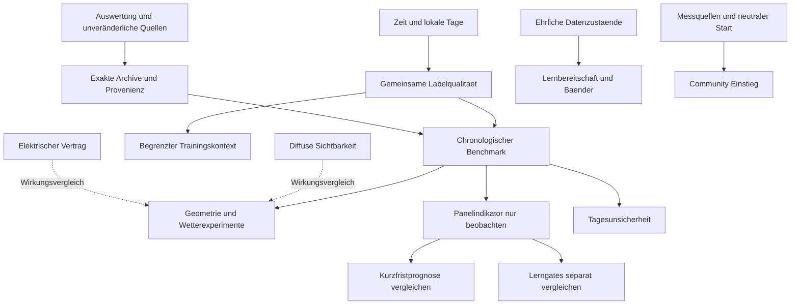

# Umsetzungsplan für Prognosequalität Benutzererfahrung und Open Source

Die nächste Entwicklungsphase sollte die vorhandenen Prognosen zuverlässig vergleichbar machen, bestätigte Fehler beheben und den Einstieg für fremde Anlagen vereinfachen. Zusätzliche Modellkomplexität folgt dort, wo ein zeitlich sauberer Vergleich ihren Nutzen zeigt. Die Woche 25.09.–01.10. ist dafür ein Diagnosefenster; sie wird nach dieser intensiven Sichtung nicht nochmals als unangetasteter Erfolgstest verwendet.

Grundlage ist der [vertiefte Siebentagebericht](2026-10-02-siebentageanalyse-projektreview.md). Das [Konzept für gemeinsame Panel- und Wettersignale](2026-10-02-konzept-wolkenindikator-aus-paneldaten.md) beschreibt den ergänzenden Nutzervorschlag. Dieser Plan ist ein Vorschlag für folgende PRs, keine Ist-SPEC und keine Freigabe für Live-Konfigurationsänderungen.

## Ziele und nachweisbare Ergebnisse

| Ziel | Primärer Nachweis | Was dafür nicht ausreicht |
|---|---|---|
| Bessere Tagesplanung | DC- und AC-Tages-MAE/Bias bei festem Ausgabestand | Nur saldierter Wochenfehler |
| Bessere zeitliche Prognose | Stunden-/Slot-MAE, Rampenfehler, Morgen-/Mittags-/Nachmittagsauswertung | Gute Tagessumme mit gegenläufigen Fehlern |
| Nützliche Unsicherheit | Deckung, einseitige Fehlerraten, Bandbreite und geeigneter Quantil-/Intervallscore | Drei Treffer oder summierte Stundenquantile allein |
| Verlässliches Lernen | Keine Mutation bei ungültigen Labels, richtiger Zeit-/Kurvenbezug, sichtbare Trainingsabdeckung | Nur Coverage-Prozentzahl |
| Einfacher Anlagenstart | Neue fremde Anlage ohne private Beispielwerte erfolgreich eingerichtet | Erfolgreicher Reload der Referenzanlage |
| Wartbarkeit | Begrenzte typisierte Verträge und verhaltensneutrale Äquivalenznachweise | Weniger Dateizeilen nach reinem Verschieben |
| Communityfähigkeit | Reproduzierbare Einrichtung, öffentliche Fixtures, klare Support-/Beitragswege | Nur öffentliche Repositorysichtbarkeit |

Korrektheitsfehler mit unabhängig beweisbarem Vertrag benötigen keinen mehrmonatigen Wetterbenchmark, bevor sie behoben werden. Ein neues Prognosemodell benötigt dagegen einen Wirkungsnachweis; eine grüne Unit-Suite ersetzt ihn nicht.

## Reihenfolge und Abhängigkeiten

Vier Arbeitsstränge können parallel vorbereitet werden. Ein Paket bleibt jeweils klein genug für eine eigenständige Reviewentscheidung.

Privacy-Fehler, Registryprobleme, Playwright-Isolation und Dokumentationsbereinigung hängen nicht vom neuen Prognosebenchmark ab. Die erste Archivverbesserung soll früh erfolgen, damit neue Vergleichsdaten schon während weiterer Reparaturen entstehen. Historische Archive werden dabei nicht mit heutigen Parametern überschrieben.

Das Benchmarkgerüst und die Vermessung des aktuellen Ausgangsmodells beginnen parallel zu den Korrektheitsarbeiten. K3/K4 sind Voraussetzungen für die Bewertung ihrer jeweiligen Kandidaten, keine Blocker des gesamten Benchmarkaufbaus. Bestehende fehlerhafte Importpfade werden bis zu ihrer Reparatur nicht als verlässliche Trainingsdatenquelle verwendet.

## E0 Quellen und Auswertungsprotokoll sichern

**Umfang:** `scripts/validation/`, Analyseartefakte und deren Loader. Unveränderte, datenschutzgeprüfte Exporte von abgeleiteten Dateien trennen. Ein Manifest enthält Quellzeitraum, Abrufzeit, Rollen/Einheiten, Zeitzone, Hash jeder Eingabedatei, Code-/Skriptstand und Umgebung. Externe Abhängigkeiten wie September-Normierungen und alte Konfiguration gehören ebenfalls hinein.

**Konkreter Anlass:** Die bisherige lokale Auswertung normalisierte `week.json` beim Laden auf der Platte. Das wurde für künftige Wiederholungen auf Normalisierung im Arbeitsspeicher begrenzt. Der vorliegende Export ist bereits um personenbezogene Servicekontexte bereinigt; er wird nicht nachträglich als unveränderter ursprünglicher HTTP-Response bezeichnet. Bisherige Sammelhashes ersetzten außerdem kein vollständiges Eingabemanifest.

**Abnahme:** Zweiter Lauf ändert keine Quellen; gleiche Quellen/Skriptversion ergeben gleiche fachliche Ergebnisse. Ein fehlender Eingabehash oder unpassende Site-/Zeitzonenrolle wird sichtbar abgelehnt. Einheiten-, Nacht-/Tageslicht- und Teilabdeckungsregeln stehen im Report. Der Monatsbericht und seine Daten werden nicht nachträglich umgeschrieben.

**Abhängigkeiten:** keine. Keine Änderung am Prognoseverhalten oder produktiven Store erforderlich.

## K1 Zeitvertrag in zwei kleinen Reparaturen korrigieren

**K1a Providerintervalle:** `core/openmeteo_backfill.py::parse_hourly_payload` normalisiert historische Strahlungsmittel vom Endstempel auf den Start der vorausgehenden Stunde. `core/bootstrap_build.py::reconstruct_plane_hour` bekommt denselben `[start,end)`-Vertrag wie Recorderlabels und Sonnenmittelpunkt.

**Nachweis:** Handgefertigter unabhängiger Providerfall mit Wert am 10:00-Endstempel, Ist unter 09:00 und Sonnenmittelpunkt 09:30. Beide historischen Datenquellen, Mitternacht und eine vollständige Tageskurve prüfen. Parent-RED muss den falschen Join oder falschen Sonnenzeitpunkt zeigen, nicht einen fehlenden neuen Import.

**K1b Lokale Tage:** `_group_by_day`, `_filter_actuals_for_day` und `accumulate_days` verwenden für Tageszuordnung ausdrücklich die konfigurierte Zeitzone; Stundenidentitäten bleiben UTC. Tagesabgrenzung, Quantil-Evidenzdatum und Lernmarker müssen dieselbe lokale Definition benutzen.

**Nachweis:** Los Angeles und Auckland, Europa-DST mit 23/25 Stunden sowie zwei verschiedene UTC-Daten innerhalb desselben lokalen Tages. Wiederholte lokale Stunden dürfen nicht über naive Uhrzeitstrings zusammenfallen.

**Migration:** Parserreparatur verändert keine bestehenden Lernzustände von allein. Anschließend Importprovenienz und betroffene Bootstrapzeiträume diagnostizieren; einen späteren Dryrun gegen vorhandenen Zustand anbieten. Keine automatische Gesamtlöschung oder ungefragter Re-Bootstrap. `docs/BACKFILL.md` und SPEC im jeweiligen PR aktualisieren.

## K2 Labelqualität vor jeder Lernmutation vereinheitlichen

**Umfang:** `_actuals.py::_actuals_from_stats`, Bootstrapreader und `core/bootstrap_build.py::_process_day_impl`; anschließend die jeweiligen Nightlygrenzen. Eine pure Entscheidung beschreibt gültige Stunden, Basis/Einheit, Abdeckung, Kanalfehler und Tagesstatus. Ungültige Numerik, fehlende Daten, physikalisch plausible Null und zensierte Leistung werden getrennt dargestellt.

**K2a numerischer Reader:** NaN/Inf/negative DC-Labels, boolesche Werte und falsche Einheit bewusst behandeln. Ob optionale Min-/Maxfelder fehlen dürfen, gehört in den Vertrag. AC-Vorzeichenkorrektur bleibt ein gesonderter Quellvertrag; sie ist kein Grund, negative DC-Werte zu akzeptieren.

**K2b gemeinsame Quarantäne:** Kollaps/Frozenstatus wirkt vor Änderungen an Shademap, Bias, Quantilen und Nutzungsmarkern. Gültige Wetterfehler sind keine kaputten Labels. Lernerspezifische Gates bleiben zusätzlich möglich; deren Begründung und Reichweite werden ausdrücklich modelliert.

**Nachweis:** Vollständiger Vorher-/Nachhervergleich aller betroffenen Zustände für 0-Wh-Kollapstag, bytegleiche Frozenfolge, eine fehlerhafte Stunde und gesunden Kontrolltag; Wiederholung derselben Eingabe bleibt idempotent. Tests müssen den bisher noch veränderten Bias-/Quantilzustand auf dem Parent zeigen. Ein abgelehnter Tag darf im Status nicht als erfolgreicher Trainingsfortschritt erscheinen.

**Migration:** Bestehende Stores additiv lesen; keine rückwirkende Rekonstruktion erfundener Labels. Korrigierte Qualitycodes lassen sich zunächst diagnostisch ausgeben. Gemeinsamen Kernvertrag zuerst klein halten, erst danach den größeren Trainingsablauf umstellen.

## E1 Archiv und Provenienz in unabhängig prüfbaren Schritten erweitern

**E1a echte AC-Kurve:** `IssuedSnapshot`, `snapshot_issued`, Store und `_handle_get_issued_forecast` speichern/exportieren die tatsächlich berechnete AC-Kurve. Legacy `DC × η` bleibt lesbar und wird als rekonstruiert gekennzeichnet. Dieser Fix ist unabhängig von einer späteren Neudefinition des DC-/AC-Clippings.

**E1b Ausgabezeiten und Verfügbarkeit:** Ursprünglicher `computed_at`, echte Ausgabezeit und `archived_at` werden unterschieden. Fehlerhaftes `last_update_success` darf alte Daten nicht durch einen neuen Zeitstempel als frischen Forecast ausweisen. Früher ausgegebene weiterhin relevante Daten werden mitsamt ihrem Alter erhalten. Ein Snapshot wird aus einem zusammengehörigen unveränderlichen Berechnungsergebnis aufgebaut; während eines `await` darf kein neuer Lauf nur einen Teil seiner Provenienz ersetzen.

**E1c Replays ermöglichen:** Additiv Software-/Modellvertragsversion, Config-/Lernzustandsreferenz, Wetterquelle, `weather_fetched_at`, Zielintervalle und Kurvenlagen archivieren. Die Modelllaufzeit bleibt unbekannt, wenn der Provider sie nicht tatsächlich liefert; `generationtime_ms` und Abrufzeit werden nicht umgedeutet. RAW, Slow-only, θ-korrigiert und tatsächlich serviert besitzen eindeutige Felder. Modulweise Referenzen und exakte Bänder kommen in ein begrenztes Exportformat.

**Abnahme:** Engine→Snapshot→Persistenz→Reload→Service ergibt dieselben DC-/AC-Werte, einschließlich Gruppen-η, f<1/f>1, Clipping, unavailable mit Altattributen und Legacyfallback. Re-Export ändert keine damalige Ausgabe. Das Archiv liefert einen eindeutig identifizierbaren Stand je Bewertungsaufgabe.

**Speicher und Datenschutz:** Vor Erweiterung Seriengröße für eine, acht und viele Ebenen messen; im bestehenden Tagesring nur den eigenen lokalen Zieltag behalten. Wetterbilder über Schlüssel deduplizieren, keine beliebig wachsenden Rohresponses oder Kurvenkopien in Recorderattributen. Aufbewahrungs-/Größenlimits testen. Öffentliche Bundles enthalten keine Authentisierung, privaten Sensor-IDs, Koordinaten oder URLs mit Standortquery; nötige Sonnenwinkel und pseudonymisierte Rollen können explizit exportiert werden. Fehlende Inputs werden als nicht reproduzierbar markiert.

**Migration:** Äußerer Store-Envelope bleibt Version 1; innere Schemaerweiterung additiv. Unbekannte Altinformationen werden nicht aus heutiger Konfiguration ergänzt. Optionale ungesetzte Configfelder verändern weder Serialisierung noch Fingerprint. Fehler beim Zusatzexport dürfen die normale Prognose nicht stoppen.

Das tägliche Lernarchiv und eine zusätzliche Auswahl fester Benchmarkausgaben bleiben getrennte Verträge: Der bestehende erste Nachtstand und seine Lern-/Idempotenzkonsumenten werden nicht nebenbei zu einem Vorabendarchiv umdefiniert. Neue Storeabschnitte benötigen passende Validatoren, damit sie beim Laden nicht still verworfen werden. Alte Releases können neue optionale Diagnosefelder beim Zurückspeichern verlieren; ein Downgrade muss vorhandene Lerndaten schützen, verspricht aber nicht automatisch den Erhalt unbekannter Zusatzarchive.

## K3 Elektrischen Vertrag entscheiden und erst dann implementieren

**Zuerst ein ADR:** `core/engine.py::compute_forecast` benötigt einen eindeutigen Zusammenhang zwischen verfügbarer DC-Leistung, gemessener postclip DC-Leistung, Wirkungsgrad, Wechselrichtergrenze und ausgegebener AC-Leistung. Bereits gegen postclip Werte gelernte Faktoren dürfen nicht ohne Begründung als preclip Faktoren weiterverwendet werden.

**Entscheidungsgrundlage:** Betroffene Slots und Gruppen aus repräsentativen Replays zählen; getrennt f<1/f>1, Gruppen-η, Site-η, Sättigung und Bypassfälle untersuchen. Zusätzlich nichtclipende Kontrollanlagen. Der synthetische 50-W-DC/90-W-AC-Fall ist ein Korrektheitsnachweis, keine Aussage über seine Häufigkeit auf dieser Anlage.

**Abnahme:** Gemeinsame physikalische Energiegrenzen, keine künstliche Energierzeugung, konsistente Gruppenattribution und Invarianten vor/nach Clamp. Lernreferenzen und Zensierung in denselben Szenarien prüfen. Bestehende Referenzvektoren sichern den nicht betroffenen Bereich.

**Migration:** Ein versionierter Modellvertrag beschreibt die Interpretation alter Learner. Sicherung, gezielte Invalidation/Übergangslogik und Rollback getrennt planen; vorhandene Lernzustände nicht still verwerfen. Erst mit diesem Entwurf wird die SPEC geändert. E1a kann und soll vorher abgeschlossen werden.

## K4 Diffuse Sichtbarkeit gegen unabhängige Physik prüfen

**Umfang:** `core/horizon.py::_inner_elevation_integral`. Nur Richtungen mit positiver Sicht-/Einfallsgewichtung tragen zur Integration bei. Analytische Lösung gegen eine unabhängig formulierte feine Quadratur prüfen.

**Abnahme:** Mehr Transparenz senkt SVF nicht; höherer opaker Horizont erhöht ihn nicht. Horizontale, geneigte und senkrechte Flächen, Rundlauf um Nord und Rückseitenbereiche prüfen. Bestehende Tests erhalten zusätzliche Fehlervarianten, statt nur neue Referenzzahlen aus derselben Formel zu generieren.

**Auswirkungsprüfung:** Bei identischem Wetter und identischer Geometrie Änderung von Diffusleistung, Gesamtertrag und Lernerreferenz getrennt ausweisen. SVF-Prozentabweichung ist nicht gleich PV-Ertragsabweichung. Anpassung von Modellversion/Fingerprint-/Residualvertrag wie bei K3 fachlich entscheiden; kein stiller manueller τ-Ausgleich.

## P1 Diagnosefehler und Validierungsquellen absichern

**P1a Fehlertexte:** An `OpenMeteoFetcher._request_once` und der Cachegrenze sichere Fehlerkategorien mit begrenzter Zusatzinformation bilden. Diagnostics und Logs dürfen Standortqueries auch aus `aiohttp.ContentTypeError` nicht erneut herausreichen. Redigierte Configfelder allein reichen nicht.

**Nachweis:** Echte Exception mit synthetischen Koordinaten durch vollständigen Fehlerpfad führen; Ausgabe und Log gemeinsam prüfen. HTTP-/Timeout-/JSON-Diagnose bleibt für Nutzer verständlich. Keine tatsächlichen Geheimnisse für den Test verwenden.

**P1b Validierungsquelle je Entry:** `scripts/validation/bsf_fetch.py::fetch_all` löst Registryrollen, konfigurierte Messquellen und Zeitzone des gewählten Entries auf. `bsf_data.py` erhält einen rollenbasierten Offlineeingang statt privater SID-Konstanten.

**Nachweis:** Zwei gleichzeitig vorhandene Anlagen, Entityrename und abweichende Zeitzone. Prognose B darf nie mit Ist A bewertet werden. Fehlende Zuordnung wird mit einem konkreten Grund abgelehnt. Anlagenspezifische C1–C8 bleiben historische Diagnosefixtures und werden kein Community-Freigabegate.

## U1 Karten zeigen Verfügbarkeit und Lücken richtig

**U1a Datenzustand:** `PowerHistoryCard._recomputeForecast`, `_liveForecastTotal`, `_ingestDay`, `_ingestWeek` und `_table` unterscheiden gültige Null, fehlende Stunde, Teilabdeckung, laufenden Tag, unavailable und veralteten Forecast. Alte Attribute eines unavailable Sensors dürfen nicht „live“ heißen. Fehlende Messwerte werden als Lücke/„—“ mit Abdeckung sichtbar.

**U1b Registry:** `card_data.js::entityRegistry`/`ensureRegistry` behandeln Entityrename, Entfernung und Verbindungswechsel. Ein gezielter Refresh darf normale Stateupdates nicht in permanente Registryabfragen verwandeln. Eventabonnements sauber abmelden.

**U1c Bedienung:** Stabile Datums-/Modulcontrols, Fokus und aufgeklappte Details bleiben bei Updates erhalten. Ein kleiner echter Browserlauf mit Tastatur und Smartphonebreite ergänzt den Node-Harness. Der Browserlauf verwendet eigenes Profil und eigene Artefaktpfade.

**Abnahme:** Reproduzierte Stale-, Missing- und Renamefälle semantisch RED→GREEN; gesunder Tag und tatsächliche 0 Wh bleiben korrekt. Prüfen, dass fehlende Daten keine künstliche Verbesserung des Kartenfehlers erzeugen. Neue Fachlogik in kleine Datenmodelle extrahieren, Rendering danach vereinfachen.

## U2 Lernbereitschaft und Unsicherheit verständlich darstellen

**Umfang:** `sensor.py`, Quantilstatus und beide Karten. Effektive η-Quelle aus `effective_eta` ableiten; Kandidatenanzahl und angewandter Wert sind getrennte Informationen. Quantilstatus enthält Zahl unterschiedlicher lokaler Evidenztage und Anteil positiver Tageslichtslots mit tatsächlich trainierter Evidenz. Unterschiedliche Datumswerte beweisen keine statistisch unabhängigen Wetterepisoden.

**Nutzervertrag:** „Noch zu wenig Daten“, „teilweise gelernt“ und „gelernt“ beziehen sich auf konkrete Evidenz. Ein neutrales Band ist keine hohe Sicherheit. Punktprognose wird nicht ohne passenden Vertrag P50 genannt. Gesamtprognose, bisher produziert und verbleibender Ertrag erhalten eindeutige Beschriftung.

**Abnahme:** n=0/1/19/20 für η; keine/einige/alle trainierten Slots, Reset nach Geometrieänderung und stale Wetter. DE-/EN-Strings sowie schmale Karten prüfen. Diese Transparenz kann vor einer neuen Bandmethode veröffentlicht werden.

## U3 Messvertrag und neutraler Einstieg für fremde Anlagen

**U3a Messquellen:** Setup prüft Leistung statt Energie, W/kW, DC-/AC-Rolle, Quelle/Statistikfähigkeit und doppelte Kanalzuordnung. Einheitennormalisierung gilt für Live- und Recorderpfad gleichermaßen. Bei geteilter Messung mehrerer Module entweder einen ausdrücklich unterstützten Summenvertrag verwenden oder die Zuordnung ablehnen; keine doppelte Energie zählen.

**U3b neutraler Flow:** `config_flow.py::_current_values` startet bei neuen Entries mit kleiner neutraler Anlage, HA-Standort und ohne fremde Horizonte/Sensor-IDs. Bestehende Entries bleiben erhalten. Die Referenzanlage wird ein bewusst gewähltes Beispiel. ADR 0023 aktualisieren statt einen konkurrierenden zweiten Onboardingentwurf einzuführen.

**U3c Änderungsfolgen:** Vor Speichern semantischen Diff zeigen: welche Module/RAW-Basen betroffen sind, welche Lernkomponenten neu anlaufen und welche Daten erhalten bleiben. Vorhandene Fingerprint-/Reseedlogik wird benutzt; bereits korrekt ausgeschlossene Gruppenlabels werden nicht erneut als Bug behandelt.

**Abnahme:** Frische Ein-Modul-Anlage und Zwei-Ausrichtungs-Anlage ohne private IDs vollständig konfigurieren. W und kW ergeben gleiche Physik; kWh-Quelle führt zu erklärter Korrekturaufforderung. Bestehender Entry bleibt bytekompatibel, bloße Umbenennung setzt kein Lernen zurück. Oberfläche bleibt auch ohne Ist-Sensor als reine Prognose nutzbar, soweit der bestehende Vertrag dies vorsieht.

## A1 Struktur entlang der Fachverträge verbessern

**Erster Schnitt:** Messqualität aus K2 und Ausgabepresenter aus E1/U1. Typen beschreiben validierte Werte; externe Dicts werden einmal an der Grenze geprüft. `sensor.py::_build_forecast_response` kann dann in einen Presenter wechseln, den Sensor und Service gemeinsam nutzen.

**Zweiter Schnitt:** `_nightly.py` erhält einen expliziten `TrainingContext` und ein Ergebnis mit beabsichtigten Updates. Der Coordinator beschafft/taktet; der fachliche Schritt entscheidet. Aktuell 46 unterschiedliche Coordinatorzugriffe sind ein Hinweis auf implizite Kopplung. Ziel ist kleinere Abhängigkeit, kein willkürlicher Dateigrößengrenzwert.

**Dritter Schnitt:** `core/types.py` schrittweise in Konfiguration, Zeit-/Wetterinputs, Prognoseergebnisse und Lern-/Storezustände aufteilen, jeweils anlässlich einer fachlichen Änderung. Reexports schützen vorhandene Imports. Kommentarwidersprüche zu RAW/Slow-only, preclip/postclip und Shademap-Pooling vorher korrigieren.

**Abnahme:** Vollständige Ergebnis- und Persistenzgleichheit auf repräsentativen sowie geseedeten Inputs; Schedulerreihenfolge, Rollback und Idempotenz erhalten. Mypy-Ratchet schrumpft nachvollziehbar, keine neuen pauschalen Unterdrückungen. Ein Bugfix und ein großer Strukturwechsel werden getrennte PRs, sofern eine kleine gemeinsame Grenze nicht für den Fix erforderlich ist.

## T1 Integration und Plattformen gezielt absichern

**Echte HA-Kette:** Die vorhandene Lifecycle-Suite um wenige Recorderfälle ergänzen: Messstatistik→Nightly→Store→Reload. Einheitenmetadaten, fehlende Tageslichtstunde und DST sind eigene Szenarien. Fakes bleiben für die schnelle portable Suite; reale Datenbank-/Schedulergrenzen bekommen die dafür nötigen Integrationstests.

**Unabhängige Mathematik:** Golden-Matrix um relevante Tilt-/Azimut-/Breiten-/Sonnenhöhenfälle erweitern, insbesondere geringe positive Sonnenhöhe und K4-Geometrien. Generatoränderungen müssen den unabhängigen Referenzcheck auslösen. Keine Erfolgsdefinition durch Gleichheit mit einer bekannten fehlerhaften Altformel.

**Plattformen:** Echter Windows-Kernlauf zusätzlich zum Launcher-Smoke; Node-Version wie CI für die Kartenprüfung; deklarierter HA-Mindeststand weiterhin als eigener Job. Replaytests benötigen kein Netzwerk und keine privaten Daten.

**Freigabe:** `-p no:homeassistant` bleibt Pflicht, portable und echte HA-Suite getrennt. Ruff ohne Formatter, mypy, Typ-Ratchet, Importgrenze und SPEC-Vertrag laufen wie bisher. Coverage bleibt ein Rückfallwächter; zusätzliche Tests brauchen benannten Fehler-/Vertragsnachweis.

## E2 Einen fairen Prognosebenchmark einführen

Zuerst werden Zielaufgaben festgelegt: beispielsweise am Vorabend ein fester lokaler Ausgabestand für den nächsten Kalendertag, morgens ein fester Stand für die nächsten zwei Stunden und laufend getrennte 0–30-/30–120-Minuten-Horizonte. Das sind vorgeschlagene Benchmarks, keine Behauptung identischer Lead-Time der bisherigen Nachtarchive.

Ein Datensatz wird chronologisch in Entwicklungs-, Auswahl- und abschließenden Testzeitraum geteilt. Die bisher betrachteten September-/Oktobertage gehören zur Entwicklung. Jede Variante beginnt mit dem zulässigen historischen Lernzustand; Updates passieren erst, wenn ihre Labels zu diesem Zeitpunkt vorgelegen hätten. Rückblickendes Wetter und heute trainierte θ-/Shademapwerte dürfen keinen damaligen Forecast ersetzen.

Für Onlineausgaben müssen PV-Featureintervalle vollständig abgeschlossen und tatsächlich verfügbar sein, einschließlich Recorderverzug. Bewertete Zielslots liegen vollständig nach dem Ausgabestichtag. Später vollständige Stundenmittel und rückblickende Interpolation dürfen keine früheren Eingaben ergänzen.

**Vergleichsmatrix:** RAW, Slow-only, Slow-only × θ und tatsächlich servierter Forecast; anschließend jeweils genau eine neue Komponente. Derselbe Wetterinput, dieselben Zielstunden und dieselbe Qualitätsmaske gelten innerhalb einer Ablation. Ein Kandidat darf sich nicht durch das Weglassen schwieriger Stunden verbessern. Vergleichbare Baselines und ein Ausfall-/Verfügbarkeitsbericht gehören dazu.

Zwei Fragen werden getrennt ausgewertet: Eine **Anwendungsablation** vergleicht die Kurvenlagen im gleichen bereits trainierten Zustand. Eine **Lernablation** führt getrennte Zustandskopien kausal mit jeweils passender Lernreferenz fort. θ aus einem mit Shademap trainierten System auf RAW umzusetzen wäre kein gültiger Test eines Systems ohne Shademap. Später verfügbare Testlabels dürfen bei vorab festgelegtem Onlineverfahren nachfolgende Ausgaben trainieren, niemals ihre eigene frühere Ausgabe.

**Auswertung:** Gesamt- und Tages-MAE, RMSE/WAPE mit positiver Energiebasis, Bias, Tagesabschnitte, Sonnenwinkelbereiche, Forecast-Wetterklasse, elektrische Sättigung und kalter/angelernter Zustand. Beobachtete/proxybasierte Wetterreferenzen bilden eine zusätzliche Achse, ersetzen die Forecast-Klasse nicht. Unsicherheit wird auf Tagen oder zusammenhängenden Wetterepisoden resampelt; viele Sekunden aus derselben Wolke werden nicht als unabhängige Stichprobe gezählt.

**Entscheidungsregel:** Praktischen Mindestnutzen und zulässige Verschlechterung vor dem Test festlegen. Eine mögliche Ausgangsregel für Modellversuche ist ≥5 % weniger MAE in der Zielaufgabe bei stabiler Verfügbarkeit und ohne relevante Verschlechterung anderer Tagesabschnitte. Das ist ein zu beschließender Produktmaßstab, keine nachgewiesene erreichbare Verbesserung. Ein zunächst mindestens 30 abgeschlossene Tage umfassendes Testfenster ist ein Start, kein allgemeiner statistischer Beweis; seltene Wetterlagen und Saisons brauchen weitere Daten. Breite Konfidenzbereiche ergeben „noch nicht entschieden“.

**Öffentliche Reproduktion:** Kleine synthetische und anonymisierte freigegebene Bundles mit Lizenz/Provenienz; ein CLI erzeugt JSON-Metriken und einen lesbaren Bericht ohne private HA-Verbindung. Geometrie-/Wetterregime und Ein-/Mehrmodulanlagen vertreten. Private Daten dienen lokaler Zusatzvalidierung und werden kein notwendiges Contributorwissen.

## W1 bis W3 Paneldaten und Wetterprognose gemeinsam nutzen

**W1 Diagnoseprototyp:** Das gesonderte [Konzept](2026-10-02-konzept-wolkenindikator-aus-paneldaten.md) setzt zunächst nur einen gemeinsamen Änderungs-/Störungsindikator um. Zeitkohärente Portframes, Orientierung-/Gruppenbalance, getrennte Prognoseabweichung und Gründe für „unklar“ sind Pflicht. Keine dauerhafte Lernmutation und keine zusätzliche Forecastskalierung in diesem ersten Paket.

**Abnahme:** Reale dense Traces zeigen Datenabdeckung und Kandidaten; synthetische Fälle unterscheiden einzelne Schatten, gekoppelte Ostmodule, bekannte Sättigung, Datenlücken und gemeinsame Dämpfung. Gemeinsame Abregelung bleibt gegebenenfalls ununterscheidbar. PV-Daten liefern nicht gleichzeitig Indikator und vermeintlich unabhängige Wolkenlabels.

**W2 Kurzfristhorizont:** Vorhandenes Intradayverfahren gegen einfachen Summenquotienten, robustes Panelsignal und Panelsignal plus Wetter vergleichen. Nur eine Korrekturinstanz für denselben Restfehler. Begrenzte Persistenz mit Horizont, erneute Prüfung nach Modellupdate, Anlauf nach Neustart. Erst bei belegtem Nutzen optional produktiv schalten.

**W3 Schattenlernen:** Zielmodul, gegebenenfalls dessen ganze elektrische Gruppe, aus dem zur Qualitätsentscheidung verwendeten Panelindikator ausschließen. Gültige Wetterfehler nicht pauschal aus Bias/Quantilen entfernen. Trainingsabdeckung, Tagesdiversität, späterer Forecastfehler und falsche Schattenalarme gemeinsam bewerten. W2 und W3 sind getrennte Freigaben; Erfolg des einen beweist den anderen nicht.

## F1 Geometrie und Wettermodelle nur gezielt verbessern

Für die Referenzanlage ist M7 relativ robust gestützt, M2 schwächer, M3 derzeit nicht überzeugend genug für neue Anpassungen. Erste Experimente untersuchen die 08–12-Uhr-Form sowie M2/M3 an eingefrorenen Referenzmasken. Keine gleichzeitige Optimierung von Horizont, τ, Albedo, Beam-Gain, Ross und θ auf denselben sieben Tagen.

Hypothesen werden getrennt geprüft: systematische Wettereinstrahlungsabweichung, lokale Schattenlage, Diffusverteilung oder grobe Bias-Tagessegmente. Ein feineres θ-Raster kann den Morgenfehler reduzieren, erhöht aber Stichprobenarmut und kann Schattenfehler verdecken. Zunächst muss ein Replay RAW→Slow-only→θ zeigen, wo die Form verloren geht. Globale θ-Absenkung ist durch den guten 12–13-Uhr-Bereich nicht gerechtfertigt.

Ein Wettermodellvergleich braucht identische echte Ausgabehorizonte. [Previous Runs](https://open-meteo.com/en/docs/previous-runs-api) und [Historical Forecast](https://open-meteo.com/en/docs/historical-forecast-api) haben unterschiedliche historische Bedeutung. Bessere retrospektive Wetterdaten dürfen nicht als bessere damalige Prognose verkauft werden. Zusätzliche Satelliten-/Bodenreferenzen sind Diagnoseinputs mit eigener Provenienz und Verfügbarkeit.

## F2 Tagesunsicherheit eigenständig kalibrieren

Zuerst E1 um wirklich eingefrorene Slot- und Tagesbänder erweitern. Danach Deckung und Scores nach Ausgabehorizont, vorhergesagter Wetterklasse und Anzahl unabhängiger Tage messen. Ein nominelles 80-%-Band benötigt genügend unterschiedliche Ereignisse; 30 Tage allein ergeben noch keine präzise Kalibrierung.

Kandidaten sind ein eigener Tagesresidualring oder gemeinsame tageweise Residualpfade, die zeitliche Abhängigkeit erhalten. Unabhängig gezogene Stundenfehler und bloße Summen marginaler Quantile sind kein Ersatz. Verglichen werden mindestens Banddeckung, einseitige Verletzungen, Bandbreite und ein geeigneter Intervallscore. Ein beliebig breites Band gewinnt damit nicht automatisch.

**Abnahme:** Untrainierte Gruppen bleiben ehrlich gekennzeichnet; informative Bänder verbessern den vorher festgelegten Score im Holdout. Quantile wahren P10≤P50≤P90. Eine eigenständige Punktprognose wird nicht still zum Median erklärt und erhält einen eigenen Vertrag. Tagesmethode, kalte Zustände, Reset und Migration werden gemeinsam dokumentiert.

## O1 Open Source Einstieg und Mitarbeit erleichtern

**Für Betreiber:** Englischer Quickstart mit neutralem Ein-Modul-Beispiel, optionalen Messquellen, Lernanlauf, Update-/Rücknahmeweg und passenden Screenshots. Verständliche Hauptansicht, Diagnose separat. Datenquellenattribution sichtbar; Code-Lizenz und Wetterdatenlizenz unterscheiden.

**Für Contributor:** Kleine Architekturkarte und Glossar, dokumentierte Fachgrenzen, standardisierte Fixtures und ein erster offline ausführbarer Test. Verbindliche Regeln in CLAUDE/CONTRIBUTING konzentrieren; datierte Analysen bleiben Historie. Veraltete Versionsbehauptungen und personengebundene Co-Authorpflichten bereinigen. Keine zweite normative Voll-SPEC anfangen, bevor deren Pflege geklärt ist.

**Für Zusammenarbeit:** Bugreport-/Featureformulare, Supportumfang, privater Securityweg und Kriterien für reproduzierbare Prognosefehler. Diagnostics erst nach P1 als unkomplizierte Beilage empfehlen. Kleine Einstiegsissues können Docstringkorrekturen, η-Provenienz oder neutrale Beispielkonfiguration betreffen; Physik-/Storemigrationen benötigen erfahrene Reviews.

**Abnahme:** Ein neuer Contributor kann anhand dokumentierter Kommandos ohne privates HA die portable Suite und einen Benchmarkfall ausführen. Eine fremde Anlage kann U3 ohne Kenntnis der Referenzsensoren einrichten. Versions-/Setupinformationen widersprechen sich nicht.

## D1 Zwei Playwright-Instanzen ausdrücklich isolieren

`scripts/playwright-mcp.sh` besitzt aktuell einen festen Profil- und Outputpfad. Ein Folgeschritt ergänzt eine ausdrücklich gewählte Instanzkennung oder getrennte Pfadparameter; `.codex/config.toml` und `docs/PLAYWRIGHT-MCP.md` dokumentieren die Nutzung. Profil A und B teilen weder Chromiumlocks noch Loginzustand oder Ausgabedateien. Passwörter und Sitzungsdateien werden nicht kopiert.

**Abnahme:** Zwei gestartete Testinstanzen verwenden unterschiedliche Profile/Outputs, ihre Tablisten sind getrennt, Stoppen einer Instanz beendet die andere nicht. Diese Prüfung findet mit eigenen Testprofilen statt. Laufende Benutzerbrowser oder Lockdateien werden nicht gelöscht. Im vorliegenden Review wurde keine Störung beobachtet; der Code garantiert bislang keine Isolation zweier Server desselben Checkouts.

## Gemeinsame Definition eines abgeschlossenen Pakets

Jeder PR beschreibt konkreten Auslöser und resultierendes Verhalten, betroffene Verträge sowie relevante Validierung. Bugfixes enthalten semantischen Parent-RED, Refactorings Äquivalenzbelege. SPEC wird bei Verhaltensänderung im selben PR angepasst; CHANGELOG folgt dem bestehenden Workflow. Ungesetzte optionale Felder verändern keine Altconfig, alte Stores bleiben lesbar und Lernzustände werden nicht still verworfen.

Produktive Auslieferung erfolgt über grünen PR, Merge, synchronen Versionsstand, regulären Tag/Release und HACS mit Live-Verifikation. Physik-/Lernänderungen benötigen vorab einen begrenzten Rollout und einen Rücknahmeplan. Anlagengeometrie ist ein getrennter Betreiberentscheid. Messbare Verbesserung und ehrliche Zustände haben Vorrang vor der Zahl neuer Parameter oder Sensoren.
